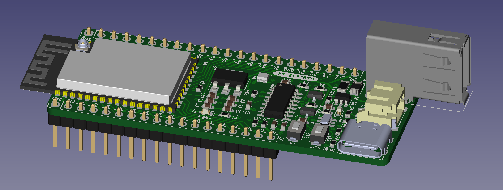
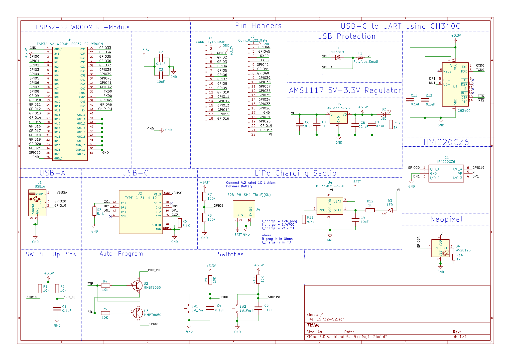
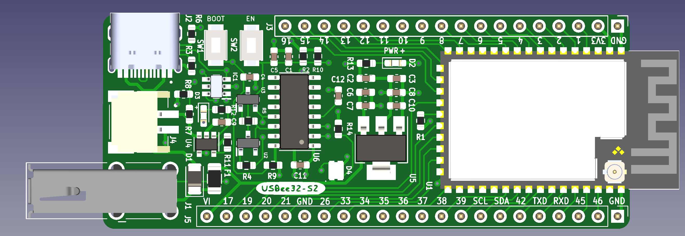
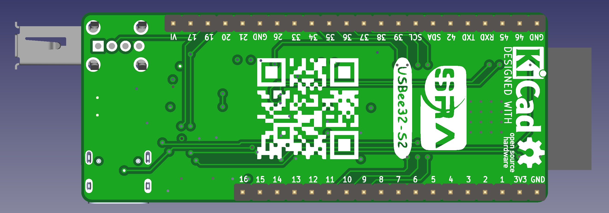

# USBee32-S2 : ESP32-S2 Hardware Design

<p align="center">


  </br>
</p>

</br>
This repository contains hardware design files and datasheets for the ESP32-S2. This is an open source ESP32-S2 based PCB with breakout ports for both USB - Type A and USB - Type C.
</br>


## Features

* Small form factor of 68.4mm x 27.9mm
* Four layered customly designed general purpose Development board
* Uses ESP32-S2-WROOM RF module
* Breakout ports for both USB - Type A and USB - Type C
* Uses CH340C which gives a high current output converting USB to UART logic
* Powering modes for the ESP - Either can be used
  - USB - A: Using a USB A Male Cable
  - USB - C: Using a USB C Male Cable(Typical Mobile charger cable)
  - VI Pin: Supplying this GPIO pin with external 5V
* Has a On - board debuggable Neopixel (RGB Led)
* Has an ESD protection device which protects the circuit from electrostatic discharge and prevents malfunction/breakdown of the device
* Uses MCP73831 for charging LiPo battery
* Can use it as a power/communicating device for a joystick/ game controller
* Space efficient PCB with integrating majority components in SMD type package 


## Project Structure

```
/assets/datasheets  - contains datasheets of various components used in the PCB
/assets/references  - contains references for the PCB
/assets/schematics  - contains schematics of the the PCB
/assets/screenshots - contains screenshots of the the PCB
.
├── assets
│   ├── datasheets   - contains datasheets of various components used in the PCB         
│   ├── references   - contains references used in making the PCB
│   ├── schematics   - contains schematics of the PCB
│   └── screenshots  - contains screenshots of the PCB
├── gerbers          - contains exportable gerber files of the PCB
├── renders          - contains models and renders of the PCB
└── USBee32-S2       
    ├── component_libraries  - contains external component libraries used 
    └── ...                  - various KiCAD PCB files
```


## Tools

To view/modify the files from this repository, install KiCAD from: [https://kicad.org](https://kicad.org)

## Schematics



## Plots

### Front side




### Back side




## Future work

- [x] Switching to a 4-layer PCB to make it more space efficient
- [x] Adding safety against electrostatic discharge (ESD)
- [x] Adding Neopixel RBG Leds
- [x] Adding Battery charging circuit
- [ ] Adding extra components to the board to deliver better functionality (Eg: OLED)
- [ ] Adding various general purpose sensors 
- [ ] Adding Firmware support

## Documentation
- Click [here](https://dhairyashah1.github.io/USBee32-S2/) to view

## Bill of Materials
- Click [here](https://docs.google.com/spreadsheets/d/1bL3xiH2Zh8nPkFcn60B3-9qF9RpFs6EWBHacvU51Qi4/edit#gid=0) to view

<!-- CONTRIBUTORS -->
## Contributors

- [Dhairya Shah](https://github.com/dhairyashah1): *Designer*
- [Chaitravi Chalke](https://github.com/chaitravi-ce): *Designer*
- [Sakshi Chikshe](https://github.com/Sakshi-0311): *Designer*
- [Vedant Paranjape](https://github.com/VedantParanjape): *Mentor*
- [Omkar Bhilare](https://github.com/ombhilare999): *Mentor*

## Organization
- [SRA-VJTI](https://github.com/SRA-VJTI)


## License
- Distributed under the [MIT License](https://github.com/dhairyashah1/pcb-design-ESP32-S2/blob/main/LICENSE).
