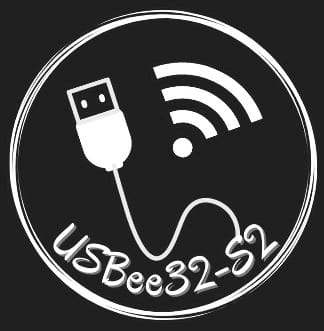
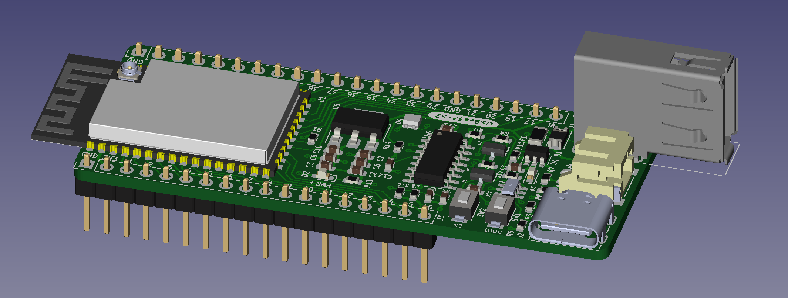
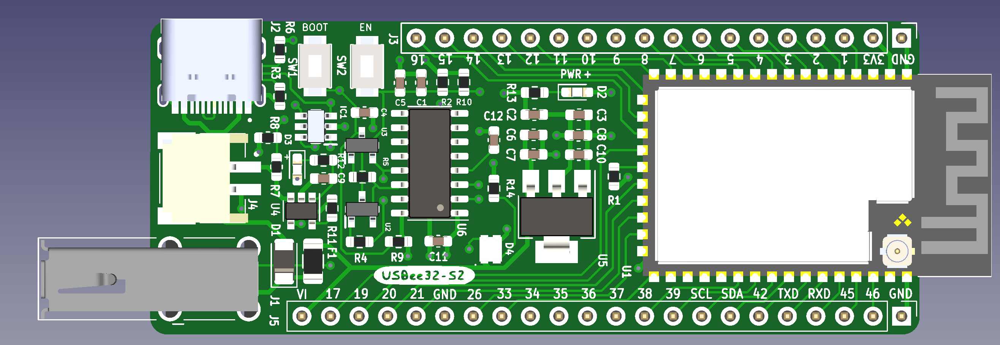
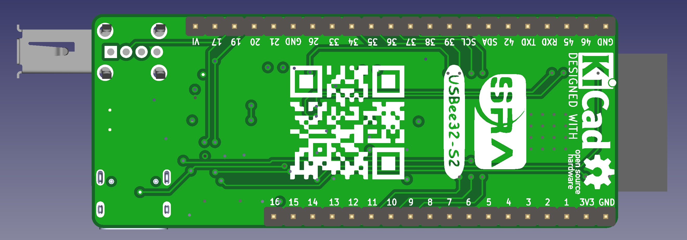
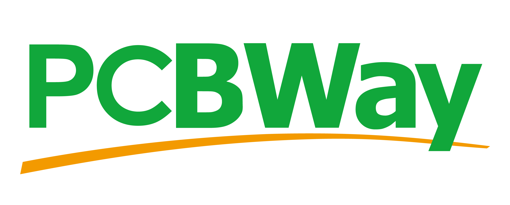

# Overview

    

The USBee32-S2 is an Open Source, General Purpose, USB (Type A and Type C) Breakout Development Board designed using ESP32-S2-WROOM Module. 

The features of USBee32-S2 [printed circuit board](https://github.com/dhairyashah1/USBee32-S2/tree/4-layer) are:   

* Small form factor of 68.4mm x 27.9mm
* Four layered customly designed general purpose Development board
* Uses ESP32-S2-WROOM RF module
* Breakout ports for both USB - Type A and USB - Type C
* Uses CH340C which gives a high current output converting USB to UART logic
* Powering modes for the ESP - Either can be used
  - USB - A: Using a USB A Male Cable
  - USB - C: Using a USB C Male Cable(Typical Mobile charger cable)
  - VI Pin: Supplying this GPIO pin with external 5V
  - JST Battery Port
* Has an On - board debuggable Neopixel (RGB Led)
* Has an ESD protection device which protects the circuit from electrostatic discharge and prevents malfunction/breakdown of the device
* Uses MCP73831 for charging LiPo battery
* Can use it as a power/communicating device for a joystick/ game controller
* Space efficient PCB with integrating majority components in SMD type package 
* Autoselect power source, i.e., battery or USB
<!-- 
## Media Coverage

* Hackster.io: [TOTP-Based Open Hardware Authenticator Powered by an ESP32 Microcontroller](https://www.hackster.io/news/totp-based-open-hardware-authenticator-powered-by-an-esp32-microcontroller-c770f10008af) -->

## Gallery
<!-- 
## Project logs

* Hackaday: [https://hackaday.io/project/176959-open-authenticator](https://hackaday.io/project/176959-open-authenticator)
## Join the Discussion: -->

<!-- * Discord: [https://discord.gg/kVDdB9kAEP](https://discord.gg/kVDdB9kAEP) -->
- <h3>General view</h3> 
- <h3>Front Side view</h3> 
- <h3>Back Side view</h3> 

## Repositories

* PCB Design: [https://github.com/dhairyashah1/USBee32-S2/tree/4-layer](https://github.com/dhairyashah1/USBee32-S2/tree/4-layer)
<!-- * Firmware: [https://github.com/Open-Authenticator/open-authenticator-app](https://github.com/Open-Authenticator/open-authenticator-app)
* 3D-Case: [https://github.com/Open-Authenticator/3d-case](https://github.com/Open-Authenticator/3d-case) -->

<!-- ## Ordering -->
<!-- ### PCB

<a href="https://oshpark.com/shared_projects/kZuvm8FV"></img></a> -->

### Components

* [Bill of Materials](https://docs.google.com/spreadsheets/d/1bL3xiH2Zh8nPkFcn60B3-9qF9RpFs6EWBHacvU51Qi4/edit#gid=0)

## Sponsors

<!-- * [OSHPark](https://oshpark.com/) - Thanks to OSHPark for sponsoring first prototype -->
* [PCBWay](https://www.pcbway.com/) - Thanks to PCBway for sponsoring the first prototype
<!-- * [Asahitec](https://www.asahitec.in/index.html) - Thanks for discounts on stencil -->

<!-- 
 -->
### Support or Contact

Having trouble with Pages? Check out our [documentation](https://docs.github.com/categories/github-pages-basics/) or [contact support](https://support.github.com/contact) and we’ll help you sort it out.
